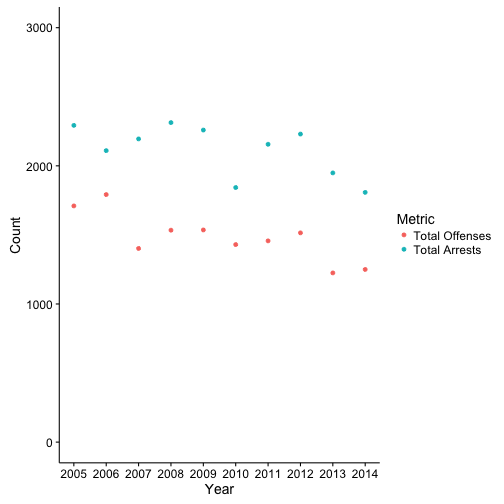
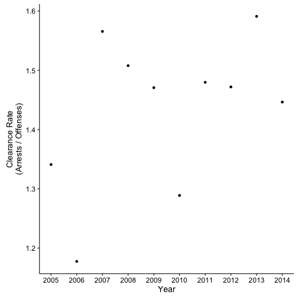

I think crime data is interesting, but here in Colorado, it's public but [not well organized](http://crimeinco.cbi.state.co.us/). The data are displayed online in tables by agency and year, at least from the early 2000s onward, but overall it's a messy venture. Ever since listening to the [http://www.apmreports.org/in-the-dark]('In The Dark' podcast), I'd been curious about how clearance rates in Colorado. Clearance rates are the ratio of 'closed' crimes to total crimes in a year.

As noted from the CBI website:
> Caution must be taken not to compare the number of criminal offenses which occurred to the number of individuals arrested for a particular crime. There is not a direct correlation between the number of individuals arrested and the number of offenses reported.

Considered yourself caveated.

This is my first attempt at webscraping. I'd read that $rvest$ and $XML$ had good tools for this.

Overall goals:
1. Scrape the data from the Colorado Bureau of Investigation
2. Clean and organize the data
3. Calculate and plot clearance rate


Some brief preamble work here...


```r
mainDir <- getwd()
subDir <- "ColoradoCrimeData"

workingDir <- file.path(mainDir, subDir)

dir.create(workingDir)
```

## Define function to read in offense data

Using the [Larimer County Sheriff 2014 crime data](http://crimeinco.cbi.state.co.us/cic2k14/agencydetails.php?id=136) here as an example, we can see that the way the data are organized will make this complicated: data have subcategories, so direct scraping won't work. Nothing a little data cleaning function won't fix. We'll need two, though - one for the offenses table and one for the arrests table.


```r
readOffense <- function(table,year,agency){
  df <- as.data.frame(table[[4]])
  names(df) <- c("Offense","Count")
  # Take off summary row
  df <- df[-nrow(df),]

  df[,2] <- as.numeric(as.character(df[,2]))

  df$Year <- year
  df$Agency <- agency

  # Data Cleaning
  df$Category <- rep(NA, nrow(df))

  ## No subcategories
  df[df$Offense == "Murder/Manslaughter",][,"Category"] <- "Murder/Manslaughter"
  df[df$Offense == "Negligent Manslaughter",][,"Category"] <- "Negligent Manslaughter"
  df[df$Offense == "Larceny/Theft",][,"Category"] <- "Larceny/Theft"
  df[df$Offense == "Arson",][,"Category"] <- "Arson"

  ## Rape
  df[df$Offense == "By Force",][,"Category"] <- "Rape"
  df[df$Offense == "Attempted",][,"Category"] <- "Rape"
  df <- df[!df$Offense == "Rape",]
  df <- df[!df$Offense == "Forcible Rape",]

  ## Robbery
  df[df$Offense == "By Firearm",][,"Category"] <- "Robbery"
  df[df$Offense == "Knife/Cutting Instrument",][,"Category"] <- "Robbery"
  df[df$Offense == "Other Dangerous Weapon",][,"Category"] <- "Robbery"
  df[df$Offense == "StrongArm",][,"Category"] <- "Robbery"
  df <- df[!df$Offense == "Robbery",]

  ## Assaults
  df[df$Offense == "Firearm",][,"Category"] <- "Assault"  
  df[df$Offense == "Forced Entry",][,"Category"] <- "Assault"  
  df[df$Offense == "Knife/Cutting Instrument",][,"Category"] <- "Assault"  
  df[df$Offense == "Other Dangerous Weapon",][,"Category"] <- "Assault"  
  df[df$Offense == "Hands/Feet/Fist",][,"Category"] <- "Assault"  
  df[df$Offense == "Other Assaults",][,"Category"] <- "Assault"  
  df <- df[!df$Offense == "Assaults",]

  ## Burglary
  df[df$Offense == "Forced Entry",][,"Category"] <- "Burglary"  
  df[df$Offense == "Unlawful Entry",][,"Category"] <- "Burglary"  
  df[df$Offense == "Attempted",][,"Category"] <- "Burglary"  
  df <- df[!df$Offense == "Burglary",]

  # Motor Vehicle Theft
  df[df$Offense == "Auto",][,"Category"] <- "Motor Vehicle Theft"  
  df[df$Offense == "Truck",][,"Category"] <- "Motor Vehicle Theft"
  df[df$Offense == "Auto",][,"Category"] <- "Motor Vehicle Theft"  
  df[df$Offense == "Other",][,"Category"] <- "Motor Vehicle Theft"  
  df[df$Offense == "Attempted",][,"Category"] <- "Motor Vehicle Theft"  
  df <- df[!df$Offense == "Motor Vehicle Theft",]

  df <- df[,c("Agency","Year","Category","Offense","Count")]

  return(df)
}
```

## Create function to read in arrest data

Once again, it's necessary to read in and clean the data.


```r
readArrests <- function(table,year,agency){
  df <- as.data.frame(table[[5]])
  names(df) <- c("Offense","Adult","Juvenile")

  df$Year <- as.numeric(year)
  df$Agency <- agency

  # Remove summary row
  df <- df[-nrow(df),]

  df <- df[,c("Agency","Year","Offense","Adult","Juvenile")]

  return(df)

}  
```

## Download the Data

I used a mix of $dplyr$ and $rvest$ for most of this. Although $for$ loops aren't the most efficient tool in R, it seems like the easiest way to go about it. The agency id field in the link corresponds to Larimer County Sherriff Department, and year iterates from 2005-2014.

Once it reads in the data, it dumps it into the agency appropriate directory so that we can then reload it without bothering with their servers.


```r
for(i in seq(5,14,1)){
  link <- paste("http://crimeinco.cbi.state.co.us/cic2k",i,"/agencydetails.php?id=136",sep="")
  yearName <- read_html(x = link) %>%
    html_nodes("h1") %>%
    html_text() %>%
    strsplit(" - ") %>%
    unlist()

  year <- yearName[1]
  name <- yearName[2]

  shortName <- gsub("[[:space:]]", "", name)

  table <- XML::readHTMLTable(doc = link,as.data.frame = TRUE)

  # Read in records

  arrests <- readArrests(table = table,
                         year = year,
                         agency = shortName)

  offenses <- readOffense(table = table,
                         year = year,
                         agency = shortName)


  # Create output directory

  agencyDir <- file.path(workingDir, shortName)

  # Save files

  if(!file.exists(agencyDir))
    dir.create(agencyDir)

  write.csv(x = arrests,
            file = paste(agencyDir,"/",year,"_",shortName,"_Arrests.csv",sep=""),
            row.names = FALSE)

  write.csv(x = offenses,
            file = paste(agencyDir,"/",year,"_",shortName,"_Offenses.csv",sep=""),
            row.names = FALSE)
}
```

## Read In The Data

Now that we have cleaned local copies, let's reread them and combine them.


```r
filesToRead <- list.files(workingDir,full.names = TRUE, recursive = TRUE)

OffenseFiles <- filesToRead[grep("Offenses",filesToRead)]
ArrestFiles <- filesToRead[grep("Arrests",filesToRead)]


Offenses <- data.frame("Agency" = NA,"Year"=NA,"Category"=NA,"Offense"=NA,"Count"=NA)
Arrests <- data.frame("Agency"=NA,"Year"=NA,"Offense"=NA,"Adult"=NA,"Juvenile"=NA)

for(i in 1:length(ArrestFiles)){
  file <- read.csv(file = ArrestFiles[i], na.strings = "Â")

  Arrests <- rbind(Arrests,file)
}

for(i in 1:length(OffenseFiles)){
  file <- read.csv(file = OffenseFiles[i], na.strings = "Â")

  Offenses <- rbind(Offenses,file)
}

Offenses$Count <- as.numeric(Offenses$Count)
```

## Summarize

Time to calculate some summary statistics (thanks to $dplyr$) and recombine the data into some new dataframes for visualizing.


```r
summaryArrests <- Arrests %>%
  group_by(Year,Agency) %>%
  summarise(totalArrests = sum(Adult,na.rm = TRUE))

summaryOffenses <- Offenses %>%
  group_by(Agency,Year,Category) %>%
  summarise(subtotalOffenses = sum(Count,na.rm = TRUE)) %>%
  group_by(Year,Agency) %>%
  summarise(totalOffenses = sum(subtotalOffenses,na.rm = TRUE))

compare <- merge(summaryArrests, summaryOffenses, by = c("Year","Agency"))

compare_long <- melt(compare,measure.vars = c("totalOffenses","totalArrests"))
levels(compare_long$variable) <- c("Total Offenses","Total Arrests")
names(compare_long)[3] <- "Metric"
names(compare_long)[4] <- "Count"


compare$clearance <- compare$totalArrests / compare$totalOffenses
```

## Plots

Great! Let's look first at our overall crime stats:



...and now our clearance rate:



So the Larimer County Sheriff Department has an average clearance rate of 1.4340469, with not much variation around that per year. So for every 1.4340469 arrests, there is 1 reported crime. This may be driven by somewhat  overlapping jurisdictions.
