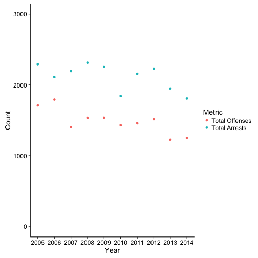

## Create Working Directories


```r
mainDir <- getwd()
subDir <- "ColoradoCrimeData"

workingDir <- file.path(mainDir, subDir)

dir.create(workingDir)
```

## Define function to read in offense data

The data on the website has categories and subcategories listed on the same page, which makes scraping it directly a little dicy.


```r
readOffense <- function(table,year,agency){
  df <- as.data.frame(table[[4]])
  names(df) <- c("Offense","Count")
  # Take off summary row
  df <- df[-nrow(df),]

  df[,2] <- as.numeric(as.character(df[,2]))

  df$Year <- year
  df$Agency <- agency

  # Data Cleaning
  df$Category <- rep(NA, nrow(df))

  ## No subcategories
  df[df$Offense == "Murder/Manslaughter",][,"Category"] <- "Murder/Manslaughter"
  df[df$Offense == "Negligent Manslaughter",][,"Category"] <- "Negligent Manslaughter"
  df[df$Offense == "Larceny/Theft",][,"Category"] <- "Larceny/Theft"
  df[df$Offense == "Arson",][,"Category"] <- "Arson"

  ## Rape
  df[df$Offense == "By Force",][,"Category"] <- "Rape"
  df[df$Offense == "Attempted",][,"Category"] <- "Rape"
  df <- df[!df$Offense == "Rape",]
  df <- df[!df$Offense == "Forcible Rape",]


  ## Robbery
  df[df$Offense == "By Firearm",][,"Category"] <- "Robbery"
  df[df$Offense == "Knife/Cutting Instrument",][,"Category"] <- "Robbery"
  df[df$Offense == "Other Dangerous Weapon",][,"Category"] <- "Robbery"
  df[df$Offense == "StrongArm",][,"Category"] <- "Robbery"
  df <- df[!df$Offense == "Robbery",]

  ## Assaults
  df[df$Offense == "Firearm",][,"Category"] <- "Assault"  
  df[df$Offense == "Forced Entry",][,"Category"] <- "Assault"  
  df[df$Offense == "Knife/Cutting Instrument",][,"Category"] <- "Assault"  
  df[df$Offense == "Other Dangerous Weapon",][,"Category"] <- "Assault"  
  df[df$Offense == "Hands/Feet/Fist",][,"Category"] <- "Assault"  
  df[df$Offense == "Other Assaults",][,"Category"] <- "Assault"  
  df <- df[!df$Offense == "Assaults",]

  ## Burglary
  df[df$Offense == "Forced Entry",][,"Category"] <- "Burglary"  
  df[df$Offense == "Unlawful Entry",][,"Category"] <- "Burglary"  
  df[df$Offense == "Attempted",][,"Category"] <- "Burglary"  
  df <- df[!df$Offense == "Burglary",]

  # Motor Vehicle Theft
  df[df$Offense == "Auto",][,"Category"] <- "Motor Vehicle Theft"  
  df[df$Offense == "Truck",][,"Category"] <- "Motor Vehicle Theft"
  df[df$Offense == "Auto",][,"Category"] <- "Motor Vehicle Theft"  
  df[df$Offense == "Other",][,"Category"] <- "Motor Vehicle Theft"  
  df[df$Offense == "Attempted",][,"Category"] <- "Motor Vehicle Theft"  
  df <- df[!df$Offense == "Motor Vehicle Theft",]

  df <- df[,c("Agency","Year","Category","Offense","Count")]

  return(df)
}
```

## Create function to read in arrest data


```r
readArrests <- function(table,year,agency){
  df <- as.data.frame(table[[5]])
  names(df) <- c("Offense","Adult","Juvenile")

  df$Year <- as.numeric(year)
  df$Agency <- agency

  # Remove summary row
  df <- df[-nrow(df),]

  df <- df[,c("Agency","Year","Offense","Adult","Juvenile")]

  return(df)

}  
```


```r
for(i in seq(5,14,1)){
  link <- paste("http://crimeinco.cbi.state.co.us/cic2k",i,"/agencydetails.php?id=136",sep="")
  yearName <- read_html(x = link) %>%
    html_nodes("h1") %>%
    html_text() %>%
    strsplit(" - ") %>%
    unlist()

  year <- yearName[1]
  name <- yearName[2]

  shortName <- gsub("[[:space:]]", "", name)

  table <- XML::readHTMLTable(doc = link,as.data.frame = TRUE)

  # Read in records

  arrests <- readArrests(table = table,
                         year = year,
                         agency = shortName)

  offenses <- readOffense(table = table,
                         year = year,
                         agency = shortName)


  # Create output directory

  agencyDir <- file.path(workingDir, shortName)

  # Save files

  if(!file.exists(agencyDir))
    dir.create(agencyDir)

  write.csv(x = arrests,
            file = paste(agencyDir,"/",year,"_",shortName,"_Arrests.csv",sep=""),
            row.names = FALSE)

  write.csv(x = offenses,
            file = paste(agencyDir,"/",year,"_",shortName,"_Offenses.csv",sep=""),
            row.names = FALSE)
}
```


```r
filesToRead <- list.files(workingDir,full.names = TRUE, recursive = TRUE)

OffenseFiles <- filesToRead[grep("Offenses",filesToRead)]
ArrestFiles <- filesToRead[grep("Arrests",filesToRead)]


Offenses <- data.frame("Agency" = NA,"Year"=NA,"Category"=NA,"Offense"=NA,"Count"=NA)
Arrests <- data.frame("Agency"=NA,"Year"=NA,"Offense"=NA,"Adult"=NA,"Juvenile"=NA)

for(i in 1:length(ArrestFiles)){
  file <- read.csv(file = ArrestFiles[i], na.strings = "Â")

  Arrests <- rbind(Arrests,file)
}

for(i in 1:length(OffenseFiles)){
  file <- read.csv(file = OffenseFiles[i], na.strings = "Â")

  Offenses <- rbind(Offenses,file)
}

Offenses$Count <- as.numeric(Offenses$Count)
```

```r
#Arrests$Year <- as.Date(strptime(as.character(Arrests$Year), "%Y"))
```

## Summarize

```r
summaryArrests <- Arrests %>%
  group_by(Year,Agency) %>%
  summarise(totalArrests = sum(Adult,na.rm = TRUE))

summaryOffenses <- Offenses %>%
  group_by(Agency,Year,Category) %>%
  summarise(subtotalOffenses = sum(Count,na.rm = TRUE)) %>%
  group_by(Year,Agency) %>%
  summarise(totalOffenses = sum(subtotalOffenses,na.rm = TRUE))

compare <- merge(summaryArrests, summaryOffenses, by = c("Year","Agency"))

compare_long <- melt(compare,measure.vars = c("totalOffenses","totalArrests"))
levels(compare_long$variable) <- c("Total Offenses","Total Arrests")
names(compare_long)[3] <- "Metric"
names(compare_long)[4] <- "Count"


compare$clearance <- compare$totalArrests / compare$totalOffenses
```
## Brief Analysis Plots



